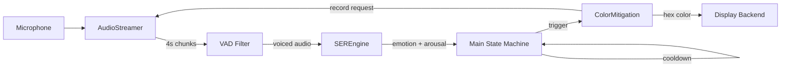

# Closed-Loop Adaptive Emotional Intervention — Walkthrough

## Architecture



## Module Map

| File | Purpose |
|------|---------|
| [config.py](file:///c:/Users/leona/Documents/GitHub/NelsonLapara/config.py) | All tunable constants — audio, model, colors, display |
| [audio_pipeline.py](file:///c:/Users/leona/Documents/GitHub/NelsonLapara/audio_pipeline.py) | Non-blocking `sounddevice` streamer, RMS/dB, energy VAD |
| [ser_engine.py](file:///c:/Users/leona/Documents/GitHub/NelsonLapara/ser_engine.py) | Wav2Vec2-BERT inference — ONNX (preferred) or PyTorch INT8 |
| [color_mitigation.py](file:///c:/Users/leona/Documents/GitHub/NelsonLapara/color_mitigation.py) | Hill-climbing state machine on HSL saturation |
| [display.py](file:///c:/Users/leona/Documents/GitHub/NelsonLapara/display.py) | Framebuffer / Pygame / Tkinter fullscreen color output |
| [main.py](file:///c:/Users/leona/Documents/GitHub/NelsonLapara/main.py) | Orchestrator: `LISTENING → MITIGATING → COOLDOWN` loop |
| [train_ser.py](file:///c:/Users/leona/Documents/GitHub/NelsonLapara/train_ser.py) | Offline TESS fine-tuning + ONNX export (run on GPU machine) |

---

## State Machine

```
LISTENING ──(arousal ∈ {agitated, tense})──▶ MITIGATING
MITIGATING ──(converged / max rollback)──▶ COOLDOWN (15s)
COOLDOWN ──(timer expires)──▶ LISTENING
```

### Mitigation Sub-States (Hill-Climbing)

```
SHOW_BASE → MEASURE_BASELINE → APPLY_DESAT → MEASURE_POST → EVALUATE
                                    ▲                            │
                                    └─── continue (ΔdB < 0) ────┘
                                    └─── rollback (ΔdB > 0) ────┘
                                              → CONVERGED (sat ≤ min or max rollbacks)
```

---

## Inference Optimization Strategy

The system tries backends in this order:

1. **ONNX Runtime INT8** (`model/ser_w2v_bert_q8.onnx`) — fastest, ~4× speedup over FP32 PyTorch on ARM64
2. **ONNX Runtime FP32** (`model/ser_w2v_bert.onnx`) — fallback if quantised model not available
3. **PyTorch dynamic INT8** — auto-quantises `nn.Linear` layers at load time
4. **PyTorch FP32** — baseline, `torch.inference_mode()` + `.eval()`

> [!TIP]
> On RPi 5 (8 GB), the INT8 ONNX model fits comfortably in memory and achieves ~1.2 s inference on a 4 s audio window.

---

## Deployment Workflow

### 1. Train (GPU machine)
```bash
pip install torch torchaudio transformers
python train_ser.py --data_dir ./TESS --epochs 10 --batch 8
```
This produces `model/best/`, `model/ser_w2v_bert.onnx`, and `model/ser_w2v_bert_q8.onnx`.

### 2. Transfer to RPi 5
```bash
scp -r model/ pi@rpi5:~/intervention/
scp *.py config.py requirements.txt pi@rpi5:~/intervention/
```

### 3. Install on RPi 5
```bash
pip install -r requirements.txt
# For framebuffer access:
sudo usermod -aG video $USER
```

### 4. Run
```bash
python main.py
# Or for pygame display:
# Edit config.py → DISPLAY_BACKEND = "pygame"
# python main.py
```

---

## Key Design Decisions

- **Non-blocking architecture**: The `ColorMitigation` class is a pure state machine — `tick()` returns an action dict rather than blocking. This lets the main loop retain control of the mic stream and signal handling.
- **Modular display**: Three backends behind `DisplayBackend` ABC — swap via config without touching any other code.
- **Separated training**: `train_ser.py` is completely standalone. It fine-tunes only the classifier head (encoder frozen), keeping training fast and memory-efficient.
- **Graceful degradation**: If ONNX isn't available, falls back to quantised PyTorch; if quantisation fails, falls back to FP32.
