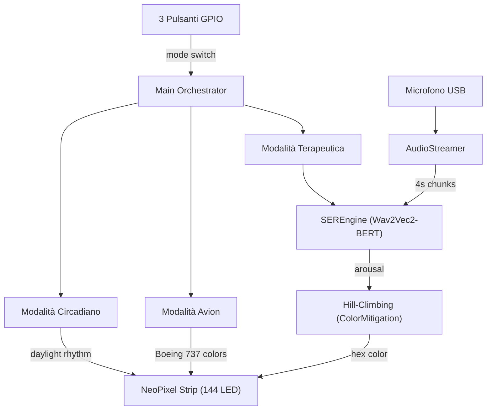

# Closed-Loop Adaptive Emotional Intervention — Walkthrough

## Hardware Setup

```
Raspberry Pi 5 (8 GB)
├── GPIO 18 (PWM0) ──── WS2812B NeoPixel Data (144 LED)
├── GPIO 17 ──── Pulsante 1: Modalità Terapeutica
├── GPIO 27 ──── Pulsante 2: Modalità Avion
├── GPIO 22 ──── Pulsante 3: Modalità Circadiano
└── USB ──── Microfono
```

> [!IMPORTANT]
> I pulsanti usano `pull_up_down=PUD_UP` (resistenza interna pull-up). Collegare ogni pulsante tra il pin GPIO e GND. Premere il pulsante porta il pin a LOW (FALLING edge).

### Alimentazione NeoPixel
- La striscia da 144 LED a piena luminosità può assorbire ~8.6A (60 mA × 144).
- **Alimentare la striscia con un alimentatore 5V esterno**, non dal RPi.
- Collegare il GND dell'alimentatore al GND del RPi.

---

## Architecture



---

## Le 3 Modalità

### 1. 🟢 Terapeutica (GPIO 17)
Intervento emotivo ad anello chiuso (SER + hill-climbing):
1. Ascolta il microfono in finestre da 4 secondi
2. Il VAD filtra il silenzio
3. Wav2Vec2-BERT classifica l'emozione → arousal (calm/tense/agitated)
4. Se agitato: mostra colore verde calmante sui LED
5. Hill-climbing: desatura progressivamente, misura i dB, rollback se peggiora

### 2. ✈️ Avion (GPIO 27)
Simula l'illuminazione cabina del Boeing 737 Sky Interior:

| Fase | Colore | Descrizione |
|------|--------|-------------|
| Boarding | `#FFD580` | Ambra caldo |
| Takeoff | `#C4A8FF` | Viola tenue |
| Cruise Day | `#87CEEB` | Azzurro cielo |
| Cruise Night | `#1A1A4E` | Indaco profondo |
| Meal | `#FFE4B5` | Bianco caldo |
| Landing | `#FFB347` | Arancione tramonto |

Ogni fase dura 30 s, con cross-fade di 3 s tra una e l'altra. Il ciclo si ripete.

### 3. 🌅 Circadiano (GPIO 22)
Segue il ritmo della luce naturale in base all'ora locale:

| Ore | Colore | Descrizione |
|-----|--------|-------------|
| 06–08 | `#FF8C42` | Alba |
| 08–10 | `#FFD700` | Mattina dorata |
| 10–14 | `#F5F5DC` | Mezzogiorno naturale |
| 14–17 | `#87CEEB` | Pomeriggio azzurro |
| 17–19 | `#FF6347` | Tramonto |
| 19–21 | `#8B4513` | Sera ambra |
| 21–23 | `#2C1A4E` | Notte indaco |
| 23–06 | `#0D0D2B` | Notte fonda |

I colori sfumano gradualmente nell'ultimo 30% di ogni blocco orario.

---

## Module Map

| File | Scopo |
|------|-------|
| [config.py](file:///c:/Users/leona/Documents/GitHub/NelsonLapara/config.py) | Tutte le costanti: audio, modello, colori, GPIO, LED |
| [audio_pipeline.py](file:///c:/Users/leona/Documents/GitHub/NelsonLapara/audio_pipeline.py) | Streamer `sounddevice`, RMS/dB, VAD ad energia |
| [ser_engine.py](file:///c:/Users/leona/Documents/GitHub/NelsonLapara/ser_engine.py) | Inferenza Wav2Vec2-BERT: ONNX INT8 → PyTorch INT8 → FP32 |
| [color_mitigation.py](file:///c:/Users/leona/Documents/GitHub/NelsonLapara/color_mitigation.py) | Macchina a stati hill-climbing sulla saturazione HSL |
| [led_strip.py](file:///c:/Users/leona/Documents/GitHub/NelsonLapara/led_strip.py) | Driver NeoPixel WS2812B con cross-fade thread-safe |
| [buttons.py](file:///c:/Users/leona/Documents/GitHub/NelsonLapara/buttons.py) | Controller pulsanti GPIO con interrupt e debounce |
| [mode_avion.py](file:///c:/Users/leona/Documents/GitHub/NelsonLapara/mode_avion.py) | Ciclo illuminazione cabina Boeing 737 |
| [mode_circadian.py](file:///c:/Users/leona/Documents/GitHub/NelsonLapara/mode_circadian.py) | Ciclo luce circadiana basato sull'ora locale |
| [main.py](file:///c:/Users/leona/Documents/GitHub/NelsonLapara/main.py) | Orchestratore centrale: gestione modalità e loop |
| [train_ser.py](file:///c:/Users/leona/Documents/GitHub/NelsonLapara/train_ser.py) | Training offline TESS + export ONNX (su GPU) |

---

## Deployment

```bash
# 1. Train (GPU machine)
python train_ser.py --data_dir ./TESS --epochs 10 --batch 8

# 2. Transfer to RPi 5
scp -r model/ pi@rpi5:~/intervention/
scp *.py requirements.txt pi@rpi5:~/intervention/

# 3. Install on RPi 5
sudo pip install -r requirements.txt

# 4. Run (sudo needed for PWM DMA)
sudo python main.py
```
